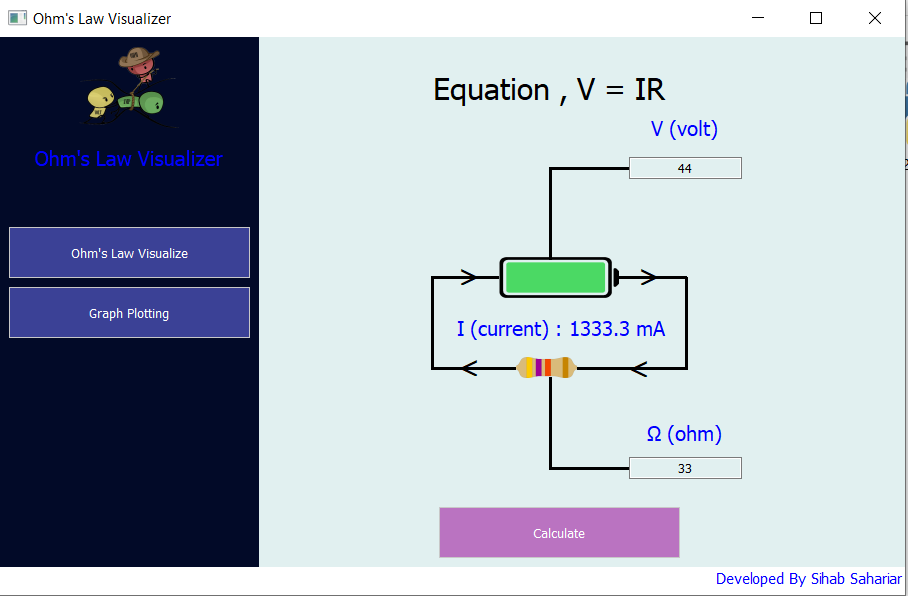
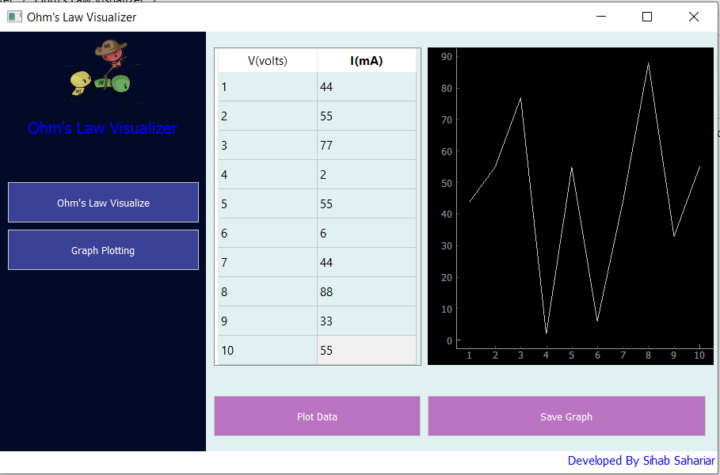

# Ohm-s-Law-Visualizer
It's an application to calculate I from v and r using Ohm's Law. It can also plot a graph between V vs I. 

# Story
I'm doing my Undergrad in CSE at BRAC University. In Fall 2021, I'm doing Physics Course (PHY112). Because of COVID pandemic, we are attending class from home. So, our lab classes are being coducted online. To simulate Ohm's Law , we are using [https://phet.colorado.edu/en/simulations/ohms-law] and that's my inspiration to create my own tool like that. So I created this tool. One thing more, in my software I've also added the graphing tool to complete my lab assignment at the same time using the same software which eventually saved my times. 

# How to Run?
Install these dependecy first. 
```
pip install PyQt5
pip install pyqtgraph
```
now run the main file.
```
python main.py
```

# Screenshot


